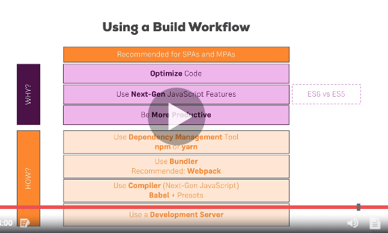

# React concepts:

## Creating the APP:

1. install create-react-app dependency via npm -> npm install -g create-react-app
2. create react app -> create-react-app my_app
3. move into app folder -> cd my_app
4. start server of react app -> npm start
5. Folder Structure:
    1. In root:
        package.json: declaring the react apps dependencies, which are

            "@testing-library/jest-dom": "^4.2.4",
            "@testing-library/react": "^9.5.0",
            "@testing-library/user-event": "^7.2.1",
            "react": "^16.13.1",
            "react-dom": "^16.13.1",
            "react-scripts": "3.4.1"
            
    2. In Public, 
       1. we can only have single html page (index.html)
       2. the manifest.json is the file for supporting the dependencies of PWA's
In public/src,
       3.index.js searches for the id named as 'root' in index.html and injects the react code
		
        ```javascript
        ReactDOM.render(
		  <React.StrictMode>
		    <App />
		  </React.StrictMode>,
		  document.getElementById('root')
		);
        ```

		Thus internally loading the App react object <App /> from `import App from './App';`

## Worflow
